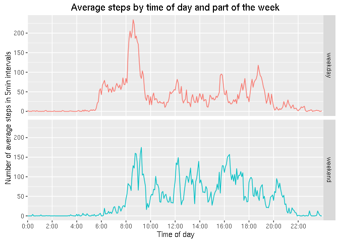

# Reproducible Research: Peer Assessment 1


## Loading and preprocessing the data

1. Load the data

```r
if (!file.exists("activitiy.zip")) {
  download.file(
    "https://d396qusza40orc.cloudfront.net/repdata%2Fdata%2Factivity.zip",
    "activity.zip",
    method = "wget"
  )
}
if (!file.exists("activity.csv")) { unzip("activity.zip") }
activity <- read.csv("activity.csv")
```

Let's take a short look on the loaded data:

```r
dim(activity)
```

```
## [1] 17568     3
```

```r
head(activity)
```

```
##   steps       date interval
## 1    NA 2012-10-01        0
## 2    NA 2012-10-01        5
## 3    NA 2012-10-01       10
## 4    NA 2012-10-01       15
## 5    NA 2012-10-01       20
## 6    NA 2012-10-01       25
```

```r
str(activity)
```

```
## 'data.frame':	17568 obs. of  3 variables:
##  $ steps   : int  NA NA NA NA NA NA NA NA NA NA ...
##  $ date    : Factor w/ 61 levels "2012-10-01","2012-10-02",..: 1 1 1 1 1 1 1 1 1 1 ...
##  $ interval: int  0 5 10 15 20 25 30 35 40 45 ...
```

2. Process the data into a format suitable for your analysis

```r
library(dplyr,warn.conflicts = FALSE)
library(lubridate)
library(ggplot2)
library(reshape2)
library(zoo,warn.conflicts = FALSE)

timestamped_activity <- activity %>%
  mutate(hour = floor(interval/100),
         minute = interval %% 100,
         timestamp = ymd(date) + hours(hour) + minutes(minute),
         interval_nr = 12*hour+minute/5)

interval_from_nr <- function(nr) {100 * floor(nr/12) + 5 * (nr%%100)}
interval_nrs_2h  <- 2*0:12*12
labels_2h        <- c(sprintf("%i:00",2*0:12))
```

## What is mean total number of steps taken per day?

1. Calculate the total number of steps taken per day


```r
steps_by_day <- activity %>%
  group_by(date) %>%
  summarize(total_steps = sum(steps,na.rm=TRUE))
```

2. Make a histogram of the total number of steps each day

```r
ggplot(steps_by_day,aes(total_steps)) + 
  geom_histogram(bins = 20,alpha=0.8) +
  ggtitle("Histogram of total number of steps each day") +
  xlab("Total Steps a day") +
  ylab("Occurences") +
  scale_y_discrete() +
  geom_vline(aes(xintercept = mean(total_steps),colour="Mean"),show.legend=TRUE) +
  geom_vline(aes(xintercept = median(total_steps),colour="Median"),show.legend=TRUE) +
  scale_colour_manual("Statistics",values=c("red","blue"))
```

\

3. Calculate and report the mean and median of the total number of steps taken per day

```r
mean(steps_by_day$total_steps)
```

```
## [1] 9354.23
```

```r
median(steps_by_day$total_steps)
```

```
## [1] 10395
```
## What is the average daily activity pattern?

1. A time series plot of the 5 minute interval and the average number of steps taken, averaged across all days.


```r
steps_by_interval <- timestamped_activity %>%
  group_by(interval_nr) %>%
  summarize(average_steps = mean(steps,na.rm=TRUE),
            median_steps  = median(steps,na.rm=TRUE)) %>%
  mutate(moving_avg_steps = rollapply(average_steps,5,mean,fill=NA,na.rm=TRUE,partial=TRUE))

interval_nr_with_most_steps <-
  steps_by_interval$interval[which.max(steps_by_interval$average_steps)]
interval_with_most_steps <- interval_from_nr(interval_nr_with_most_steps)

ggplot(steps_by_interval,aes(x = interval_nr,y = average_steps)) +
  geom_line() +
  ggtitle("Average steps by time of day") +
  xlab("Time of day") +
  ylab("Number of average steps in 5min intervals") +
  scale_x_discrete(breaks=interval_nrs_2h,labels=labels_2h) +
  geom_vline(aes(xintercept = interval_nr_with_most_steps,colour="red"),
             linetype = 2,
             show.legend = FALSE) +
  geom_label(aes(x = 16*12,
                 y = max(steps_by_interval$average_steps),
                 label = sprintf("5minute interval at %i:%0i has most steps on average",
                                 floor(interval_with_most_steps/100),
                                 interval_with_most_steps %% 100)),
             show.legend = FALSE) 
```

\

2. Wich 5-minute interval, on average across all the days, contains the maximum number of steps?

```r
interval_with_most_steps
```

```
## [1] 815
```

## Imputing missing values

1. Calculate and report the total number of missing values in the dataset

```r
# Nr. of rows with NAs
sum(!complete.cases(activity))
```

```
## [1] 2304
```

That's quite a lot, there are 17568 total rows in activity, 
so 13.11 percent of our datasets.

2. Devise a strategy for filling in the missing values.

Let's take a look to the distribution of missing values:

```r
ggplot(timestamped_activity,aes(timestamp,!complete.cases(activity))) + 
  geom_point() +
  ggtitle("Distribution of missing data") +
  xlab("") + ylab("") +
  scale_y_discrete(labels=(c("Data available","Data missing")))
```

\

So, there several larger chunks of missing data,
but no individual small gaps that could be filled with something like a moving average or a simple regression. So I will take for every missing value an approximation based on the behaviour at the same interval on all other days. Let's take a look to possible candidates: average, median and moving average steps:

```r
ggplot(melt(steps_by_interval,"interval_nr"),
      aes(interval_nr,value,group=variable,colour=factor(variable))) + 
  geom_line() +
  ggtitle("Comparison between imputing steps candidates") +
  xlab("Time of day") +
  ylab("Number of steps in 5min intervals") +
  scale_x_discrete(breaks=interval_nrs_2h,labels=labels_2h) +
  scale_y_sqrt() +
  guides(color=guide_legend(title="Method")) +
  geom_point(data = timestamped_activity %>% 
                    dplyr::filter(!is.na(steps)) %>% 
                    mutate(variable="raw measured steps"),
             aes(interval_nr,steps),
             alpha=0.05) 
```

\
  
So, the median isn't a good choice to select a value for a 5 minute interval,
as very often, there are 0 steps done in a 5 minute interval, so often, that the median is much lower and most of the time just 0 than on average.
The average itself has the slight disadvantage that the average values jumps up+down from one 5minute interval to another. That is probably much due to random, so I take the moving average (window size 5) that looks decently smooth.

3. Create a new dataset that is equal to the original dataset but with the missing data filled in

```r
imputed_activity <- inner_join(timestamped_activity,steps_by_interval,by=c("interval_nr")) %>%
  mutate(steps = ifelse(is.na(steps),moving_avg_steps,steps))

# Check whether all day filled:
sum(!complete.cases(imputed_activity))
```

```
## [1] 0
```

4. Make a histogram of the total number of steps taken each day and calculate and report the mean and median total number of steps taken per day.

```r
imputed_steps_by_day <- imputed_activity %>%
  group_by(date) %>%
  summarize(total_steps = sum(steps,na.rm=TRUE))

ggplot(imputed_steps_by_day,aes(total_steps)) + 
  geom_histogram(bins = 20,alpha=0.8) +
  ggtitle("Histogram of total number of imputed steps each day") +
  xlab("Total Steps a day") +
  ylab("Occurences") +
  scale_y_discrete() +
  scale_colour_manual("Statistics",values=c("red","green","blue","yellow")) +
  geom_vline(aes(xintercept = mean(imputed_steps_by_day$total_steps),
             colour="Imputed Mean"),
             show.legend=TRUE) +
  geom_vline(aes(xintercept = mean(steps_by_day$total_steps),
             colour="Original Mean"),
             linetype=2,
             show.legend = TRUE) +
  geom_vline(aes(xintercept = median(imputed_steps_by_day$total_steps),
             colour="Imputed Median"),
             show.legend=TRUE) +
  geom_vline(aes(xintercept = median(steps_by_day$total_steps),
             colour="Original Median"),
             linetype=2,
             show.legend=TRUE)
```

\

```r
mean(imputed_steps_by_day$total_steps)
```

```
## [1] 10766.15
```

```r
median(imputed_steps_by_day$total_steps)
```

```
## [1] 10765.89
```

Just to compare, the mean of the original dataset was 9354.23, the median of the original dataset was 10395.

Now, the mean and median are close to be same and they are higher. The missing data leaded to have a lower calculation of total steps in a day, as if we assume we can impute the missing data. 
Also, if we look to the original histogran, we've got a peak of days with steps of close to 0 steps, looking doubtful. Now, the peak of data is where the mean/median of data is and also pretty reasonable.

## Are there differences in activity patterns between weekdays and weekends?

1. Create a new factor variable in the dataset with the two levels "weekday" and "weekend" indicating a given date is a weekday or weekend day


```r
timestamped_activity <- timestamped_activity %>%
  mutate(part_of_week = as.factor(ifelse(wday(date,label=TRUE) %in% c("Sat","Sun"),
                                     "weekend",
                                     "weekday")
                              )
  )
```

2. Make a panel plot of the 5minute interval and average steps taken across all weekday and weekend days.

```r
steps_by_interval_and_part_of_week <- timestamped_activity %>%
  group_by(interval_nr,part_of_week) %>%
  summarize(average_steps = mean(steps,na.rm=TRUE))
            
ggplot(steps_by_interval_and_part_of_week,
       aes(x = interval_nr,y = average_steps,colour=part_of_week),
       show.legend = FALSE) +
  geom_line() +
  ggtitle("Average steps by time of day and part of the week") +
  xlab("Time of day") +
  ylab("Number of average steps in 5min intervals") +
  scale_x_discrete(breaks=interval_nrs_2h,labels=labels_2h) +
  theme(legend.position="none") +
  facet_grid(part_of_week ~ .)
```

\

O.K., I can see people don't stand up early at weekends as often before 8:00,
but to make it easier to see, I'll overlap those graphs and smooth the much randomness slightly out by taking a moving average (window size 5):


```r
moving_avg_steps_weekday <- rollapply(
  dplyr::filter(steps_by_interval_and_part_of_week,part_of_week == "weekday")$average_steps,
  5,mean,fill=NA,na.rm=TRUE,partial=TRUE
)

moving_avg_steps_weekend <- rollapply(
  dplyr::filter(steps_by_interval_and_part_of_week,part_of_week == "weekend")$average_steps,
  5,mean,fill=NA,na.rm=TRUE,partial=TRUE
)

steps_by_interval_and_part_of_week_smoothed <- rbind(
  data.frame(interval_nr = 0:287,part_of_week="weekday",average_steps = moving_avg_steps_weekday),
  data.frame(interval_nr = 0:287,part_of_week="weekend",average_steps = moving_avg_steps_weekend)
)

ggplot(steps_by_interval_and_part_of_week_smoothed,
       aes(x = interval_nr,y = average_steps,colour=part_of_week,group=part_of_week)
       )+
  geom_line() +
  ggtitle("Smoothed average steps by time of day and part of the week") +
  xlab("Time of day") +
  ylab("Number of average steps in 5min intervals (smoothed by moving average)") +
  guides(color=guide_legend(title="Part of the week")) +
  scale_x_discrete(breaks=interval_nrs_2h,labels=labels_2h)
```

\

Now, all the trend is easy to catch.
Not only are people waking up later in the weekend, obviously they are more active in terms of steps done most time of the day (beside 6-9 and 18-19).
